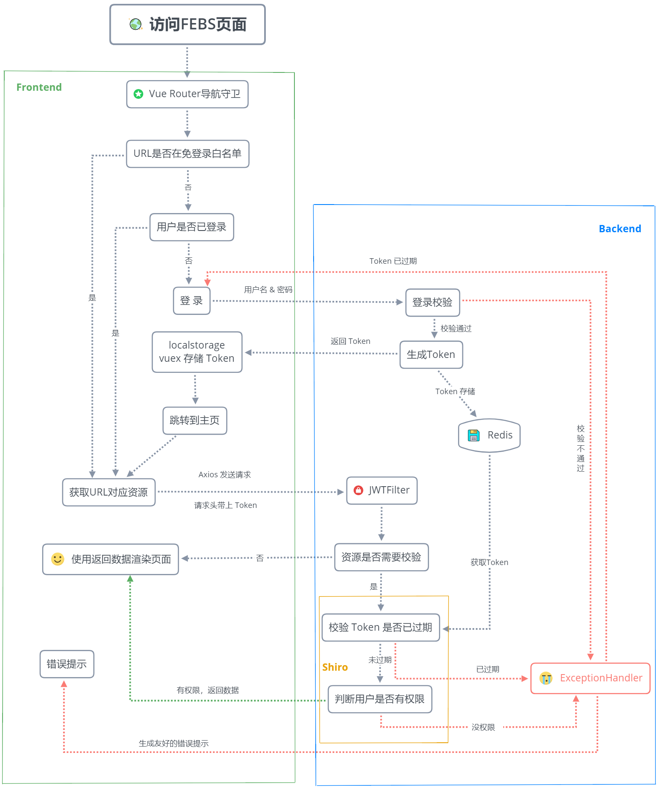
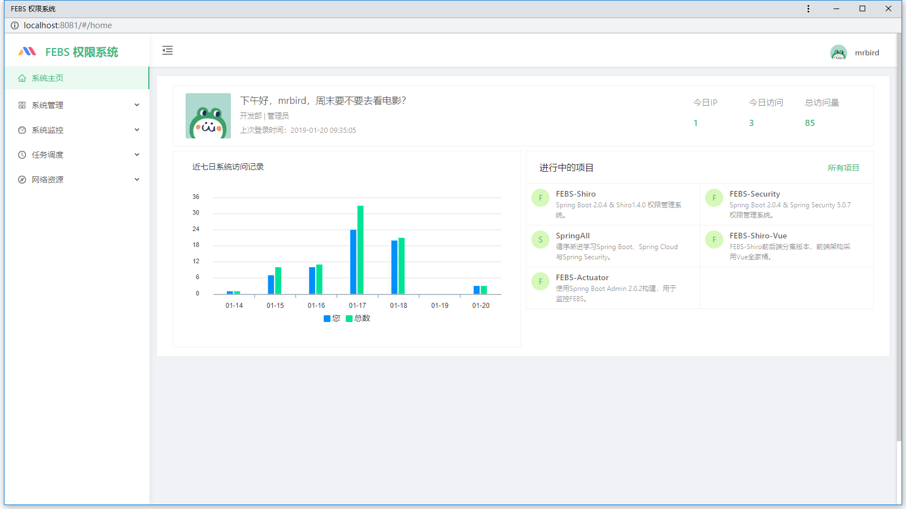
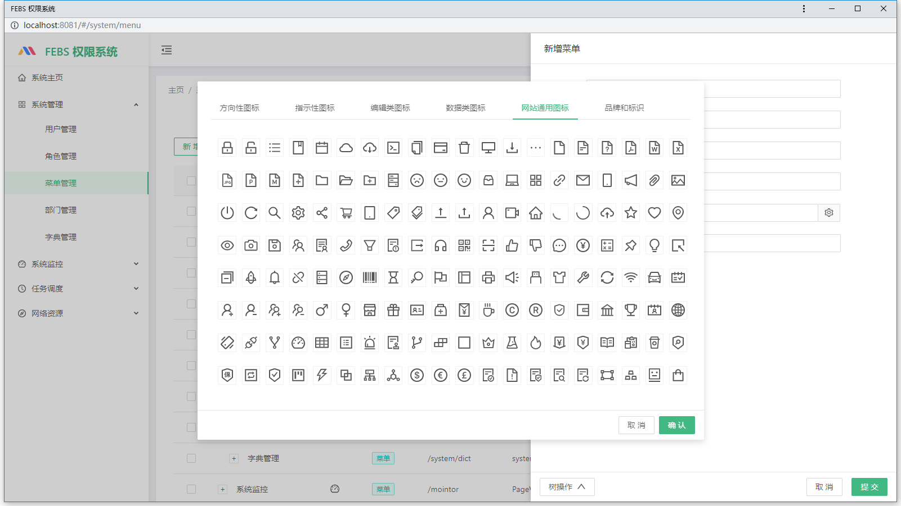
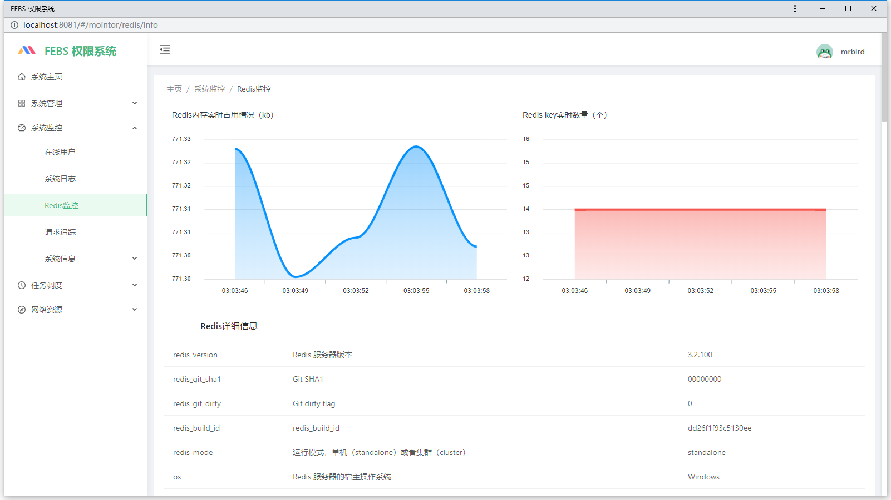
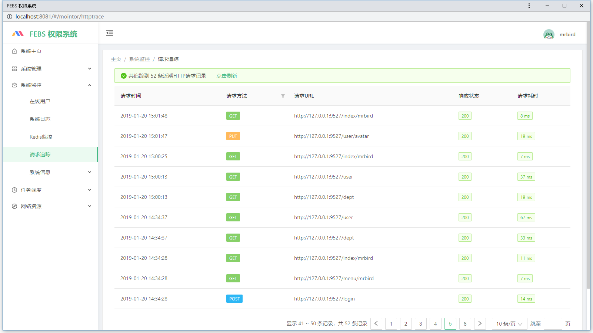
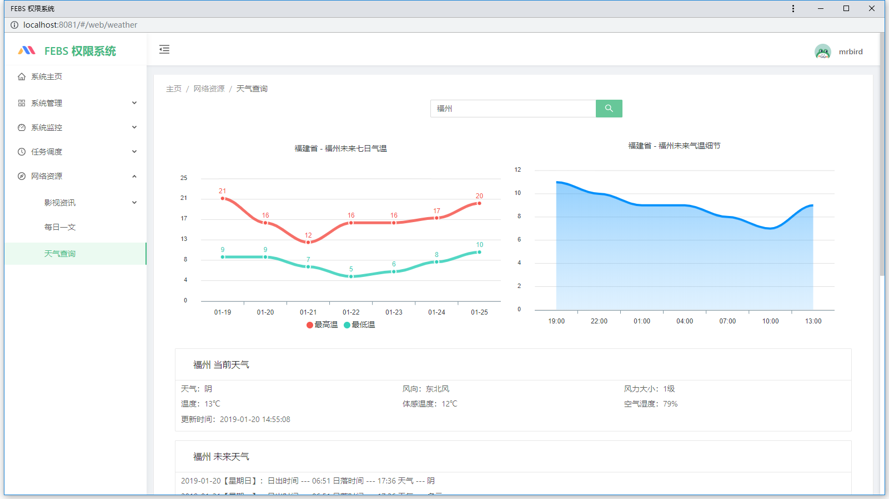
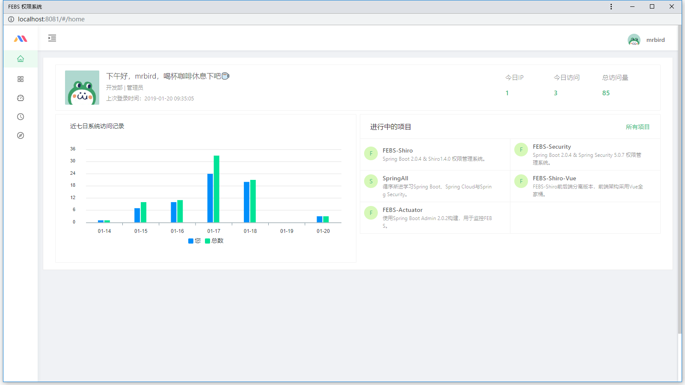
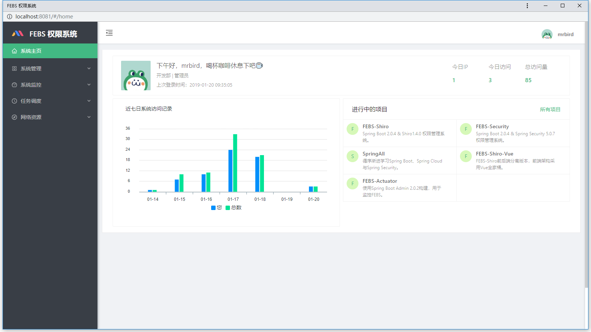
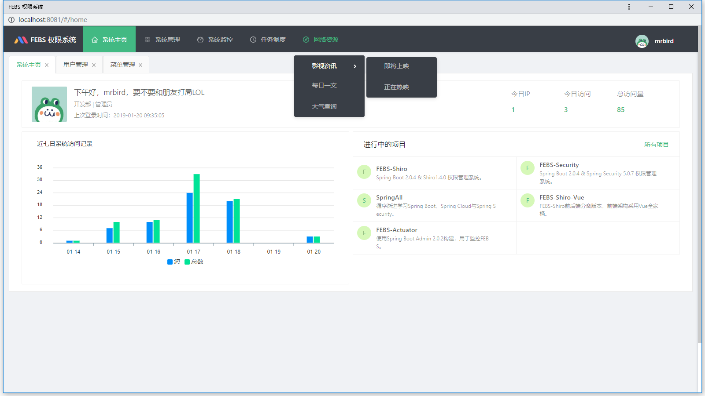

### FEBS-Vue


FEBS-Vue为[FEBS-Shiro](https://github.com/wuyouzhuguli/FEBS-Shiro)的前后端分离版本，前端使用Vue全家桶，组件库采用[Ant-Design-Vue](https://vuecomponent.github.io/ant-design-vue/docs/vue/introduce-cn/)

### 功能模块
```
├─系统管理
│  ├─用户管理
│  ├─角色管理
│  ├─菜单管理
│  ├─部门管理
│  └─字典管理
├─系统监控
│  ├─在线用户
│  ├─系统日志
│  ├─Redis监控
│  ├─请求追踪
│  ├─系统信息
│  │  ├─JVM信息
│  │  └─Tomcat信息
│─网络资源
│  ├─天气查询
│  ├─影视资讯
│  │  ├─即将上映
│  │  └─正在热映
│  └─每日一文
└─任务调度
   ├─定时任务
   └─调度日志
```
### 技术选型

#### 前端
- [Vue](https://cn.vuejs.org/),[Vuex](https://vuex.vuejs.org/zh/),[Vue Router](https://router.vuejs.org/zh/)
- [Axios](https://github.com/axios/axios)
- [vue-apexcharts](https://apexcharts.com/vue-chart-demos/line-charts/)
- [ant-design-vue](https://vuecomponent.github.io/ant-design-vue/docs/vue/introduce-cn/)
- [webpack](https://www.webpackjs.com/),[yarn](https://yarnpkg.com/zh-Hans/)

#### 后端
- [Spring Boot](http://spring.io/projects/spring-boot/)
- [Mybatis](http://www.mybatis.org/mybatis-3/zh/index.html),[TK Mapper](https://gitee.com/free/Mapper/wikis/Home),[Pagehelper](https://gitee.com/free/Mybatis_PageHelper)
- [MySQL 5.7](https://dev.mysql.com/downloads/mysql/5.7.html#downloads),[Hikari](https://brettwooldridge.github.io/HikariCP/),[Redis](https://redis.io/)
- [Shiro](http://shiro.apache.org/),[JWT](https://jwt.io/)

### 系统特点

1. 根据不同用户权限动态构建路由
2. RESTFul风格接口
3. 前后端请求参数校验
4. 支持Excel导入导出
5. 前端页面布局多样化，主题多样化
5. 自定义Vue权限指令来控制DOM元素渲染与否：

指令 | 含义| 示例
---|---|---
v-hasPermission | 当用户拥有列出的权限的时候，渲染该元素 |`<template v-hasPermission="'user:add','user:update'"><span>hello</span></template>`
v-hasAnyPermission | 当用户拥有列出的任意一项权限的时候，渲染该元素 |`<template v-hasAnyPermission="'user:add','user:update'"><span>hello</span></template>`
v-hasRole | 当用户拥有列出的角色的时候，渲染该元素 |`<template v-hasPermission="'admin','register'"><span>hello</span></template>`
v-hasAnyRole | 当用户拥有列出的任意一个角色的时候，渲染该元素 |`<template v-hasAnyRole="'admin','register'"><span>hello</span></template>`

### 请求流程
下图展示了在FEBS-Vue中一个请求的完整流程：


### 系统预览

















### 反馈交流
